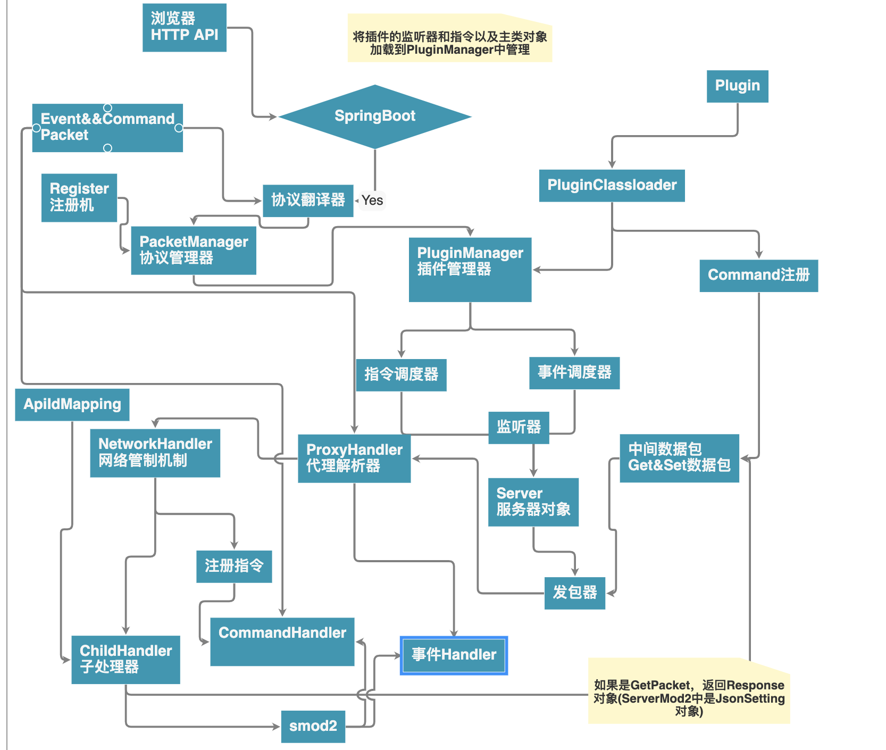

# JSMOD2 架构论 
> 总论

JSMod2(JSM)是一款基于sMod2的java插件开发框架,JSM作为服务的形式与sMod2对接,sMod2的链接JSM的客户端是ProxyHandler，在JSM-PH-SMOD2组成的跨java-c#语言开发框架建立起来，同时，内部实行了挂接注册机制来定位api对象.
> JSMod2协议
JSM底层采用了JSMod2协议与ProxyHandler进行对接

(参见[Protocol](https://github.com/jsmod2-java-c/Jsmod2_protocol](https://github.com/jsmod2-java-c/Jsmod2_protocol)

，实质上是JSON数据串,最终会被实例化为一个具体的数据对象,关于JSM协议,参见GitHub.
> JSMod2的工作原理图
内部最主要的特征是挂接注册机制

如果可以通过springboot

说明是有效的http协议，会将jsmod2协议串传输到协议翻译器

协议翻译器负责协议的解码，并获取id号和json对象串，分发到每个PacketManager中

协议翻译器首先将byte翻译为base64，再解码为注册的jsmod2协议串，然后拆分为id，json，附加请求

Packet协议管理器负责处理Event和Command请求

注册机注册了包id和事件id等
注册机相当于一个字典，记录一些定义信息

PacketManager从Register通过id拉取event类型对象
将json转化为event。
如果不是类型对象，会转化为CommandVO对象

转化为event或者vo后，将对象加入到PluginManager进行插件调度

指令调度器负责将CommandVO转化为CommandSender，args，指令名称，将调度Command对象

事件调度器将转化的event对象放入事件调度器，就会调用事件方法

当调用指令或者事件监听器内部调用api，会通过Server的发包器，将数据base64并转化为byte数组

ProxyHandler解析器会将数据再解析为jsmod2协议

会将解码后并拆分的json mapper(json转化的),id,end传输到NetworkHandler，NetworkHandler会根据id找到对应的子Handler，并将响应返回,如果是普通请求，则当Set和Get包处理，不是则当指令注册处理

ApiIdMapping是维护的对象映射表，会通过发包的uuid从里面查到对象并在子处理器操作,当jsmod2触发事件时候，会通过ProxyHandler代理解析器解析，然后发送到jsmod2的协议翻译器

注册时将CommandHandler注册进去，如果Smod2调用指令，则触发CommandHandler，然后发包

> jsmod2-server的组成

java端称为jsmod2-server，同时也可以叫做jsmod2，由core,api,protocol,child组成

* core包包含了jsmod2的核心部分，如一些模板，基本类，工具框架，协议处理器，http处理器等,为了方便移植和扩展功能

* api包含了基本的数据类(供插件开发调用的api),可以发送数据和封装等

* protocol 包含了定义的数据包，基于jsmod2-protocol的定义，适配于proxyHandler

* child是Server的子类，RegisterTemplate的子类等，负责jsmod2的启动
